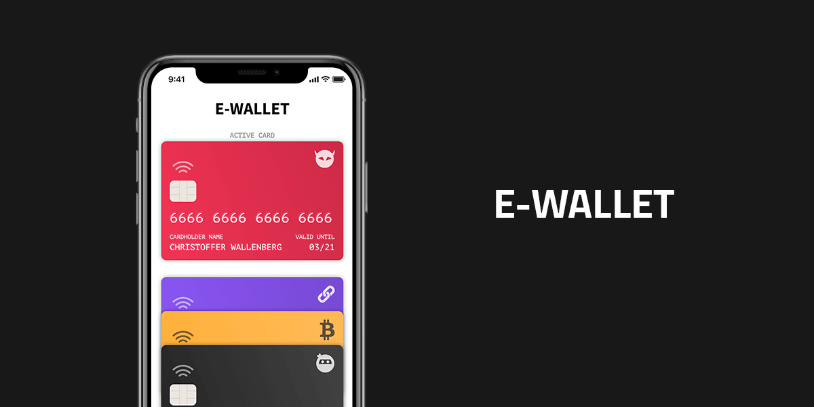

# E-Wallet Application

Live Demo: Explore the project further here: [Live Demo](https://damianamalraj.github.io/e-wallet-vuejs/)

Welcome to the E-Wallet application, a digital solution designed to consolidate all your credit cards in one place. This app enables users to view their credit cards, set an active card, and add new cards seamlessly.

## Features

- **View Credit Cards:** Users can see all their credit cards at a glance.
- **Active Card Selection:** The card at the top is the active card. Users can click on any card in the list to make it the active card.
- **Add New Card:** Navigate to the AddCard view to add a new credit card.
- **Form Preview:** The AddCard view includes a form that previews how the card will look.
- **Card List:** Every newly added card appears in a list within the AddCard view.

## Technical Requirements

The application leverages Vue.js to deliver a responsive and user-friendly interface. Key technical aspects include:

- Local properties (data)
- Inherited properties (props)
- Computed properties
- Events (Browser and Custom)
- Methods
- v-for (including key and props in a loop)
- LocalStorage (For enhanced functionality)
- Life Cycle Hook (For enhanced functionality)

## Design

The app's design follows the specifications provided in the supplied Figma mockup. It features a modern and intuitive user interface that enhances user experience.

### Typography

- **Headings:** Source Sans Pro
- **Body Text:** PT Mono

### Icons

Icons used in this project are detailed within the assets folder, adhering to the design guidelines specified in the Figma mockup.

### Figma Mockup

Här har du en [Figma-fil med Mockup](./mockup.fig) över färdiga appen.

### Demo

